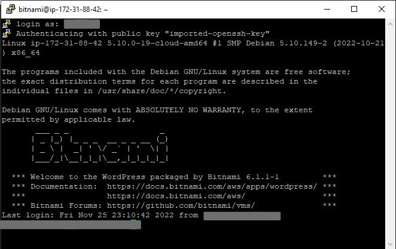

# Hosting a Wordpress site on Amazon EC2

In this proyect, i hosted a Wordpress site (www.dataqiub.com) in a EC2 instance and using route53.

Dataqiub is a startup dedicated to offering various freelance data services located in Lima - Perú.
 
 

 
